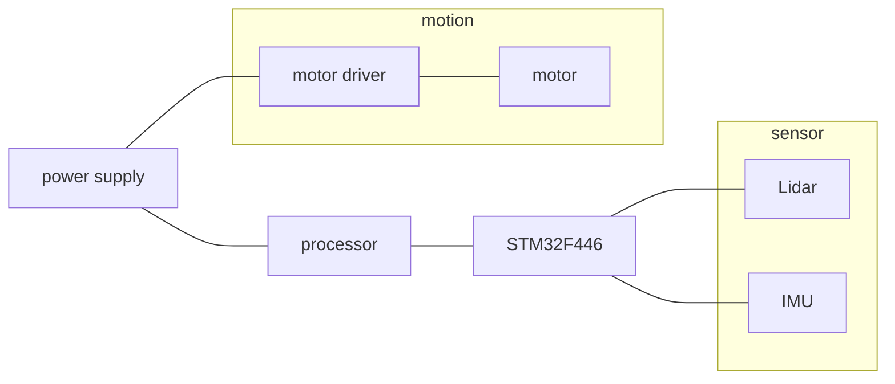

```mermaid
flowchart LR
        pro[processor]
        ps["power supply"]


        subgraph motion
                m[motor]
                md["motor driver"]
                md --- m
        end
        
        subgraph sensor
                lidar[Lidar]
                imu[IMU]
        end

        mc[STM32F446]

        ps --- pro 
        ps --- md


        pro --- mc
        mc --- imu
        mc --- lidar
```
